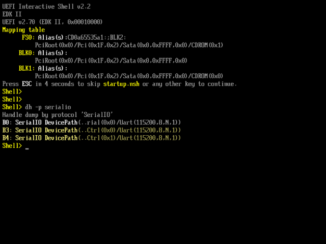

# PCIe Serial Adapter Guide on Modern PC 

Modern PC often comes with cool features like super fast USB 10G connectors, graphical UEFI firmware and RGB ~~for more FPS~~. As tech "evolves", serial ports, even the onboard serial headers are removed on modern motherboards. 

One solution is to install a PCIe serial adapter. This guide is going to tell you how to setup PCIe serial adapter for UEFI, GRUB and Linux.


## Choose you adapter

Most PCIe serial adapter on the market uses one of these 3 chips (or their variants with more port), a brief comparison is show below.

| Chip               | ASIX AX99100          | Moschip MCS9922       | WCH CH382        |
| ------------------ | --------------------- | --------------------- | ---------------- |
| Ports              | Up to 4               | 2                     | 2                |
| PCI configuration  | PCI function per port | PCI function per port | One PCI function |
| UEFI SerialIO[^1]  | ✔️                     | ✔️                     | ❗ Need Patch     |
| Linux inbox driver | ❌                     | ✔️                     | ✔️                |
| Price (Dual Port)  | $                     | $$                    | $                |

Since the price difference is acceptable, I personally suggest buying a MCS9922-based adapter.

[^1]: [PciSioSerialDxe](https://github.com/tianocore/edk2/tree/master/MdeModulePkg/Bus/Pci/PciSioSerialDxe) driver is required.


## Configuring linux kernel

Setting up PCIe serial port is pretty simple if the adapter has inbox driver. First detect which device is the serial port on the adapter. Below is an example. You may echo something to the serial ports to determine which port it is.

```bash
$ sudo dmesg | grep ttyS
[    0.396255] serial8250: ttyS0 at I/O 0x3f8 (irq = 4, base_baud = 115200) is a 16550A
[    0.396914] 0000:07:00.0: ttyS4 at I/O 0x3100 (irq = 16, base_baud = 115200) is a ST16650V2
[    0.398985] 0000:07:00.0: ttyS5 at I/O 0x3000 (irq = 16, base_baud = 115200) is a ST16650V2
```

Then set the `console=` kernel command line. For grub, simply modify `GRUB_CMDLINE_LINUX` in `/etc/default/grub`. On some distros, `quiet splash` need to be removed for kernel to print dmesg to serial.

```bash
# Replace the ttyS4 here to your serial port
GRUB_CMDLINE_LINUX="console=tty0 console=ttyS4,115200"
```

Finally run `sudo update-grub` to apply the changes. Now reboot the PC and you should able to see dmesg printed to serial.


## Configuring UEFI firmware

As a UEFI Application, grub-efi cannot directly access the IO ports on the adapter. Instead, it uses EFI Serial IO Protocol interface provided by UEFI firmware to access the adapter. This means that to use the PCIe serial adapter in grub, it must be probed and initialized by UEFI firmware.

The driver for PCIe serial adapter is [PciSioSerialDxe](https://github.com/tianocore/edk2/tree/master/MdeModulePkg/Bus/Pci/PciSioSerialDxe). It supports 16550-compatible UART controller (PCI class ID `0x070002`) with registers at 0 offset in its IO/MMIO space by default. Custom rules can also be set for non-standard adapters like CH382.

To check whether the ports on PCIe serial adapter is probed or not, simply run `dh -p serialio` command in UEFI shell. Some motherboard contains UEFI shell as a boot option, you can directly boot it. Otherwise you need to build and boot it on yor own following [this guide](../edk2-quick-ref/#build-uefi-shell). 

If the ports shows up correctly, you can skip to the next part.



Unfortunately, most consumer-grade motherboards does not contain PciSioSerialDxe driver in their BIOS. If you are using such motherboards or a CH382-based adapter, you need to build the driver and mod the firmware on your own. Guides are at

* [Building the driver](../edk2-quick-ref) 
* Modding the BIOS

To make the PciSioSerialDxe driver works with CH382-based adapters, apply [0001-OvmfPkg-add-PcdPciSerialParameters-for-CH382-PCIe-se.patch](./0001-OvmfPkg-add-PcdPciSerialParameters-for-CH382-PCIe-se.patch) and build with

```bash
build -a X64 -t GCC5 -b RELEASE -p OvmfPkg/OvmfPkgX64.dsc -m MdeModulePkg/Bus/Pci/PciSioSerialDxe/PciSioSerialDxe.inf -D SERIAL_CH382
```

## Configuring GRUB

TODO